Work done by: Sandra Mourali, Mohamed Aziz Bellaaj, Louay Badri & Salma Ghabri
---

# Task 1: Azure traffic manager profile
## 1
a. b.

c. d. 

e.
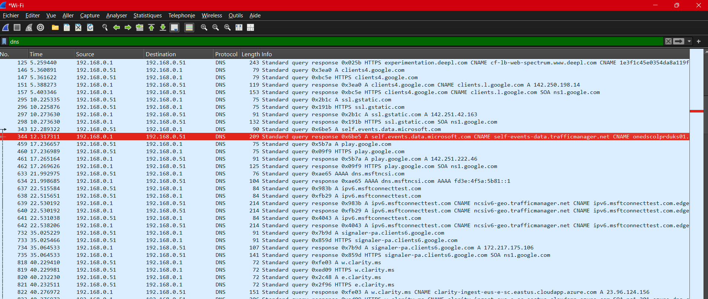
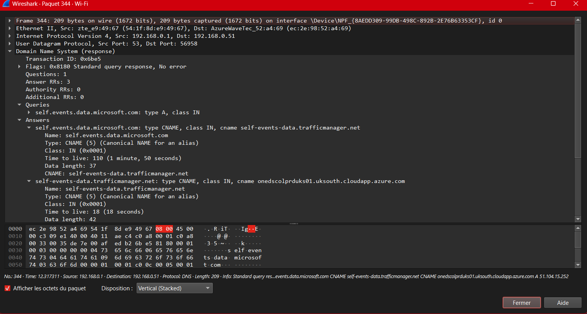

## 2. 

- **Primary Traffic Manager**:
    - **Routing Method:** Performance.
    - Directs users to the closest region:
        - UK South (via a nested Traffic Manager).
        - North Europe (direct external endpoint).
- **UK South Traffic Manager**:
    - **Routing Method:** Priority.
    - Ensures high availability by routing:
        - Primarily to **UK South VM1**.
        - Fails over to **UK South VM2** if the primary is unavailable.
This setup achieves **geo-proximity-based routing** for users and ensures **redundancy** within UK South.

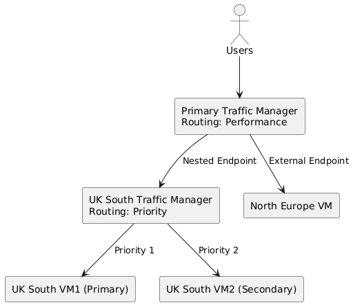

# Task 2: Azure front door

1. 
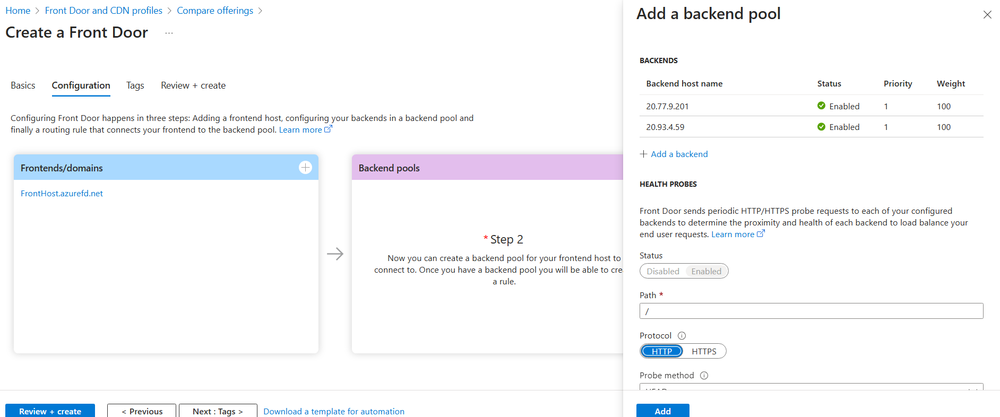
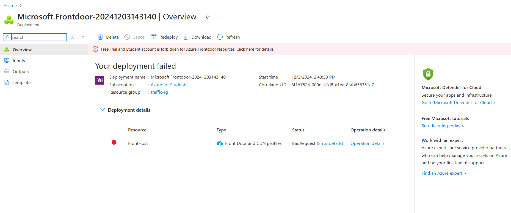

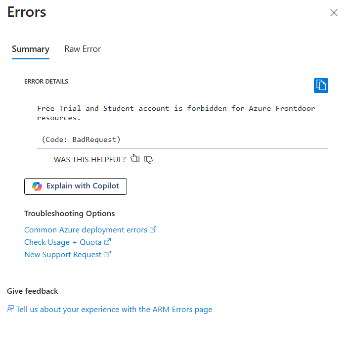

# Task 3: Azure Firewall
1. 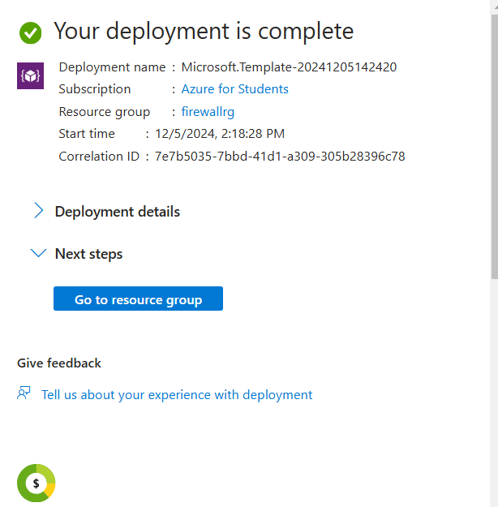

2. 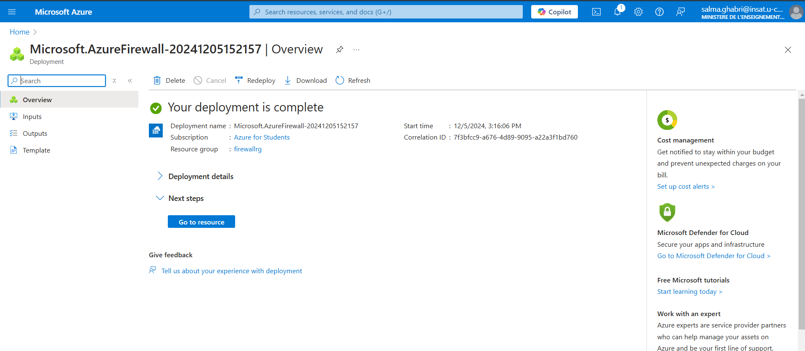
3. 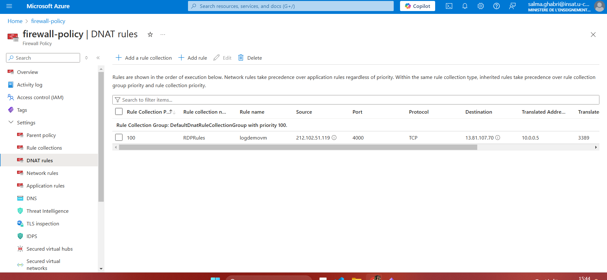
4. 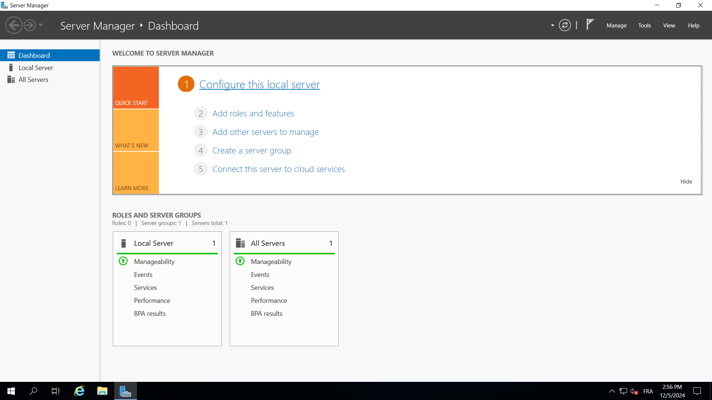
5. 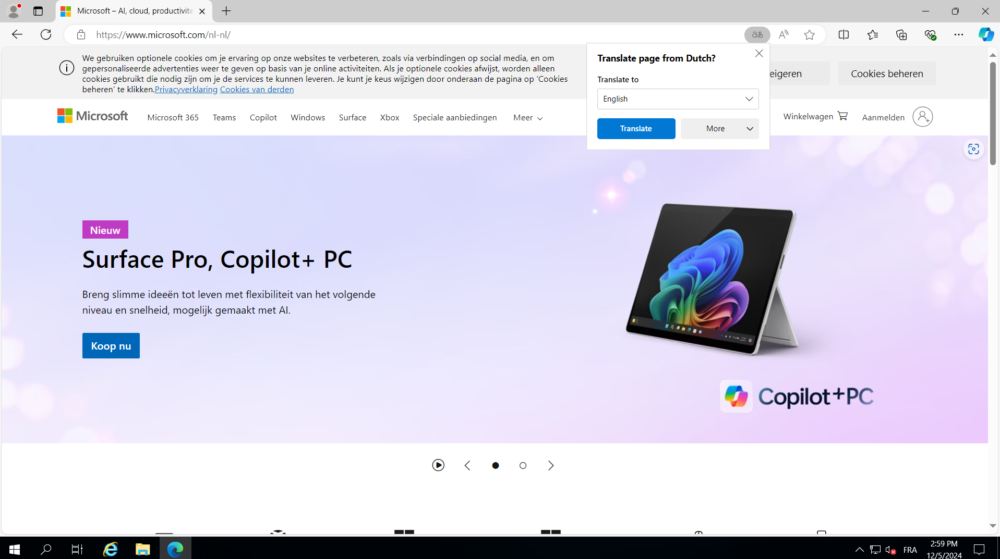

6. 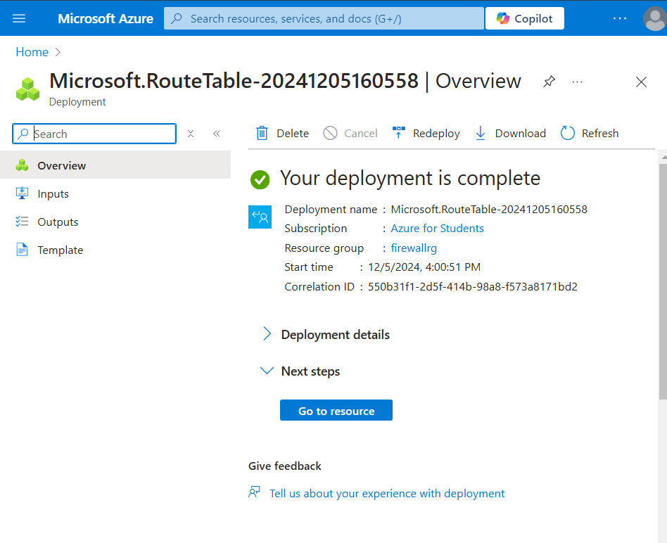
7. 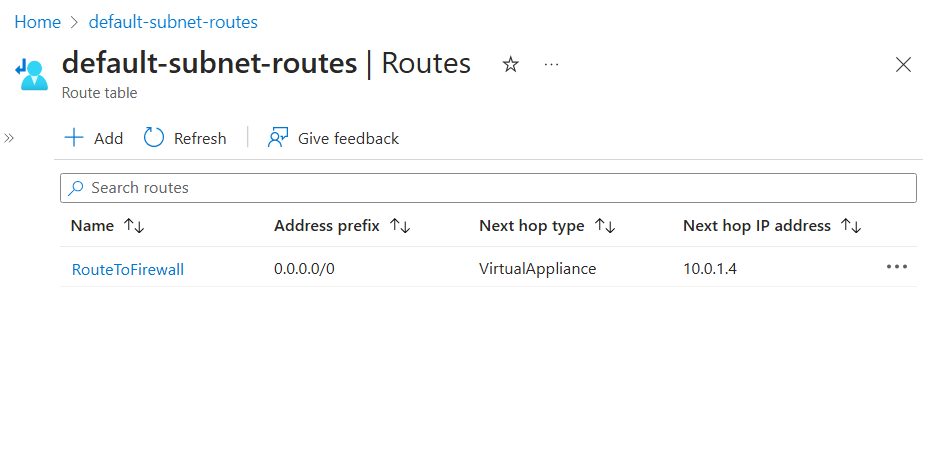
	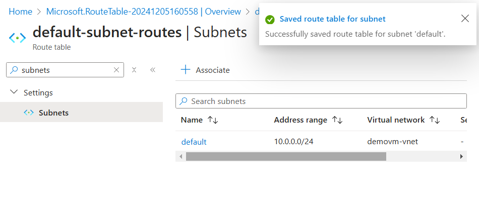
8. 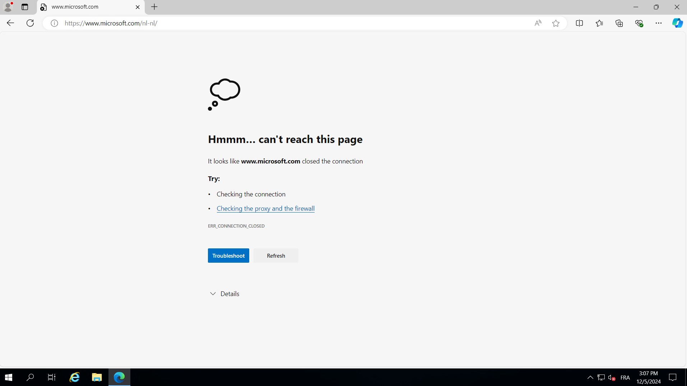
9. 10 
	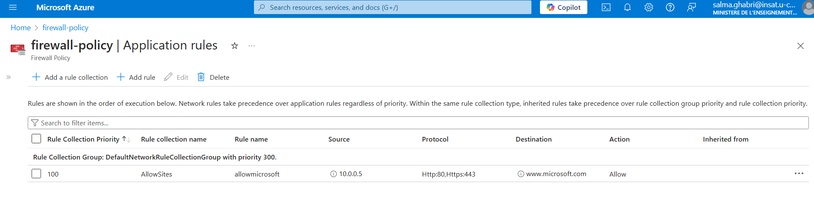
	 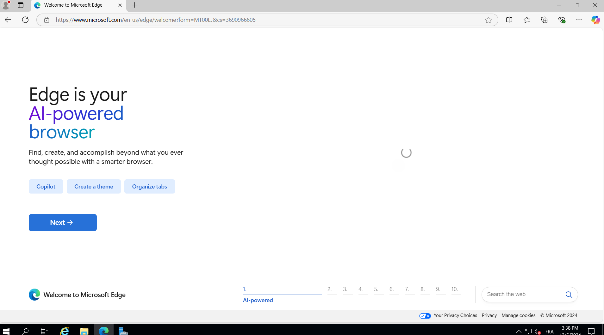

#### 11
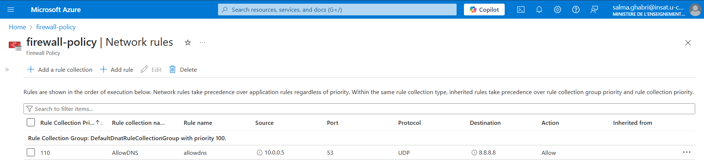
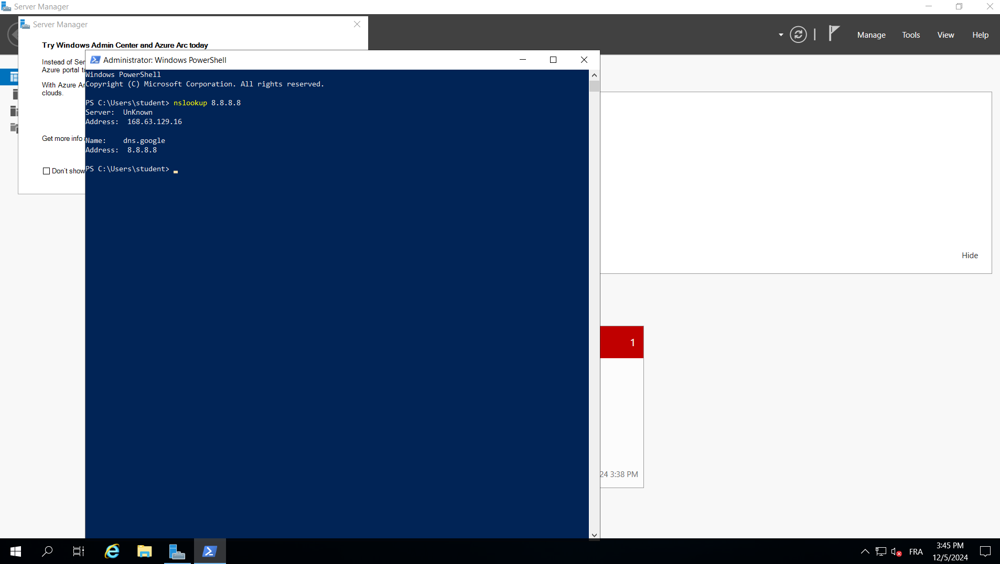