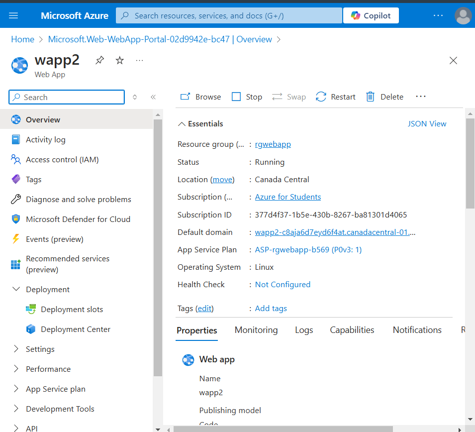
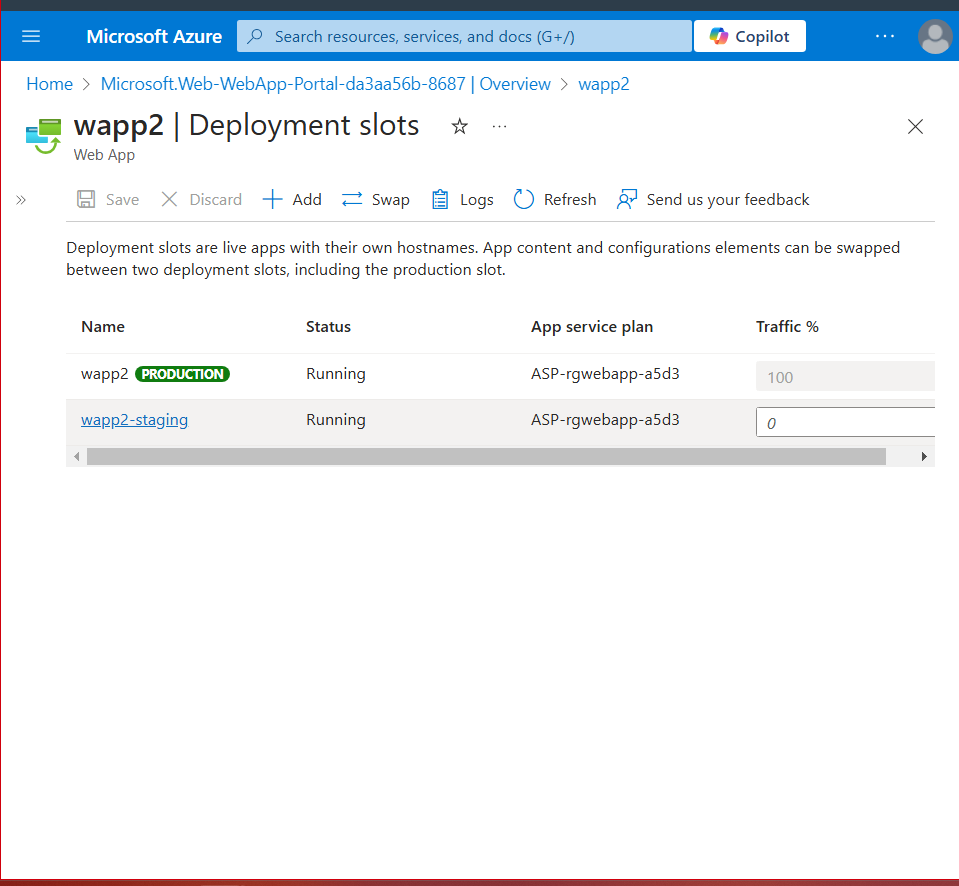
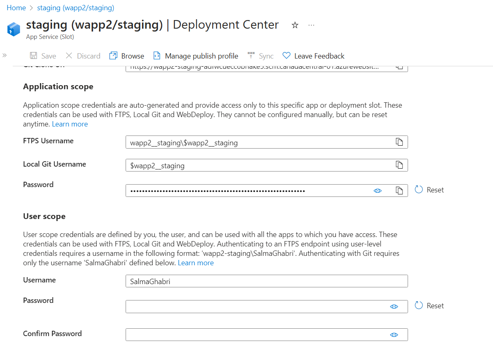
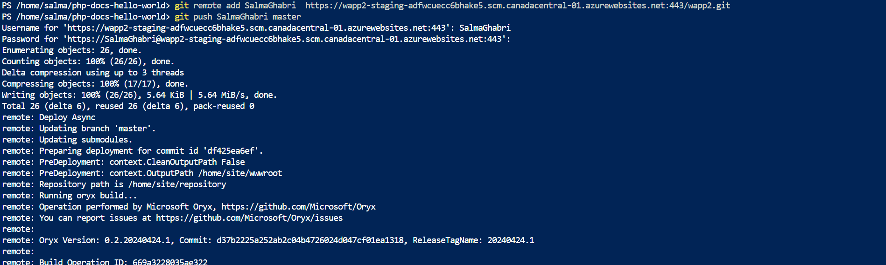
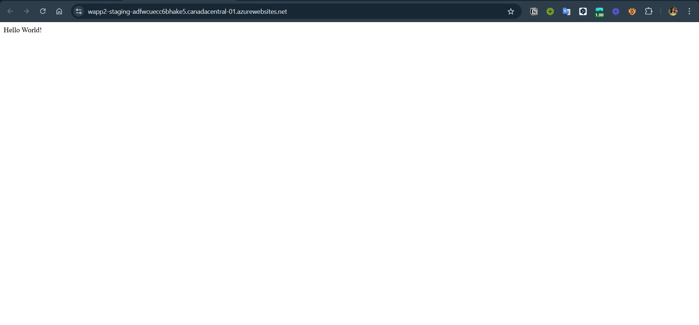
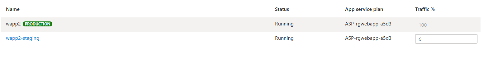
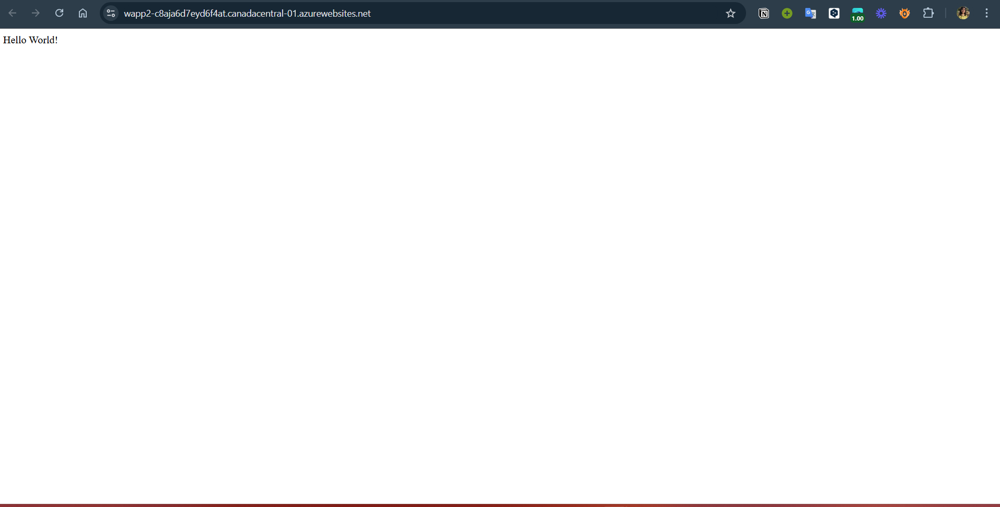
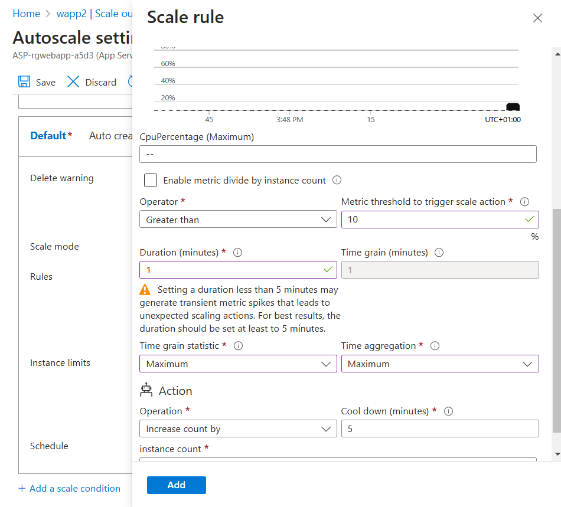
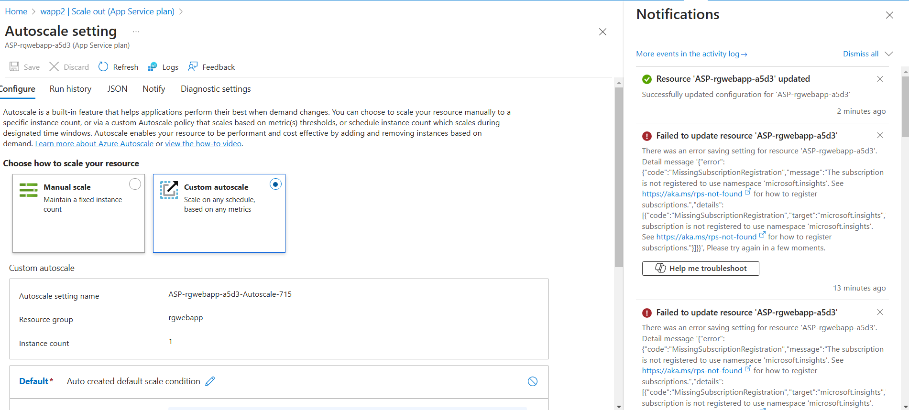
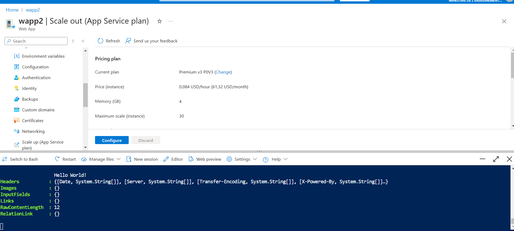

Work done by: Sandra Mourali, Mohamed Aziz Bellaaj, Louay Badri & Salma Ghabri
---
# Task 1: Azure web app
## 1 Create an Azure web app

## 2 Create a staging deployment slot

## 3 Configure web app deployment settings
https://wapp2-staging-adfwcuecc6bhake5.scm.canadacentral-01.azurewebsites.net:443/wapp2.git

## 4 Deploy code to the staging deployment slot

## 5 Swap the staging slots

## 6 Configure and test autoscaling of the Azure web app

